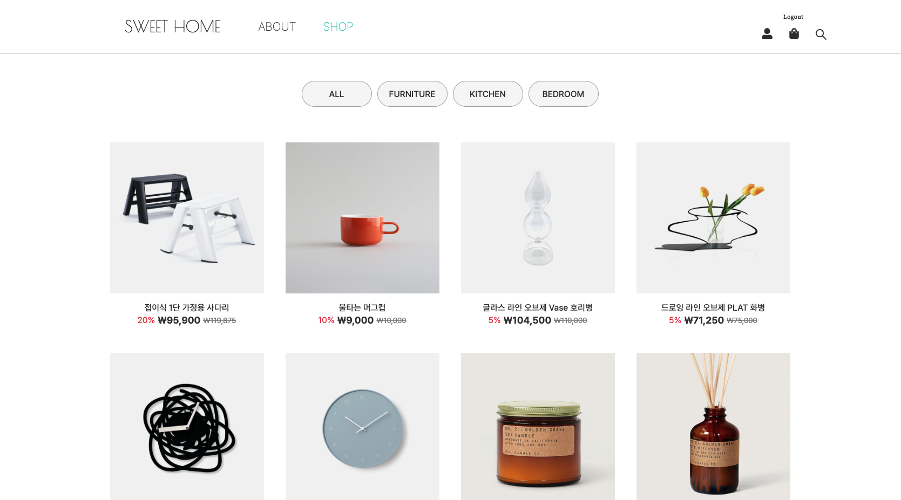
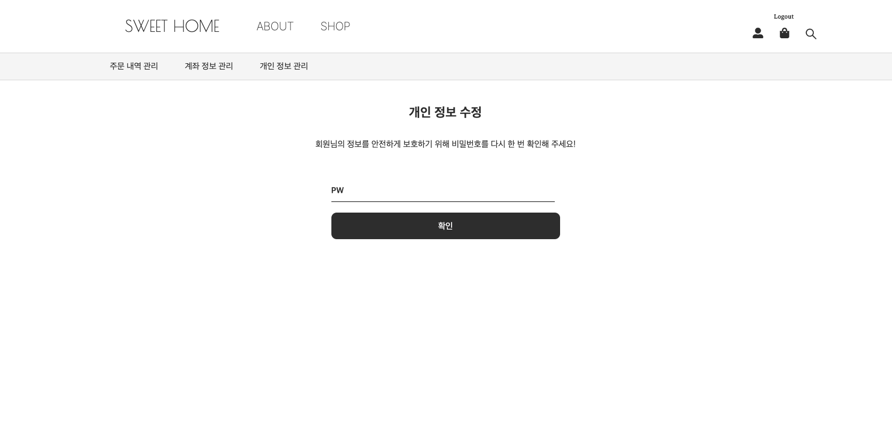
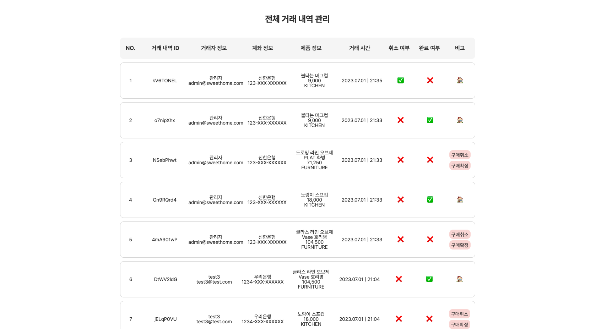

# 🏠 집 가구싶어 (SweetHome)

<p>React, TypeScript, Rest API를 활용한 라이프 스타일 홈 데코·인테리어 쇼핑몰 프로젝트입니다.<br />
성별과 연령에 상관없이 모두가 관심을 가지고 이용할 수 있는 인테리어 관련 주제로 선정하였으며,<br />
‘집(Home)’ + ‘가구(Furniture)’ + ‘가고싶다.(Want To Go)’ 의 합성어로 언제 어디서나 집에 가고싶게 만드는 제품을 판매하다는 의미의 쇼핑몰입니다.</p>

<br />

## 프로젝트 소개

> **패스트캠퍼스 프론트엔드 개발 부트캠프 5기**<br />
> **개발 기간** : 2023. 05. 30 ~ 2023. 07. 01<br />
> **배포 주소** : [DEMO](https://fe5-team9.github.io/sweethome)

<br />

## 개발자 소개

| **[김준희](https://github.com/dev-junehee)** | **[송홍빈](https://github.com/hbsongk)** | **[조은상](https://github.com/ChoEun-Sang)** | **[박근우](https://github.com/SpeedGear)** | **[백동은](https://github.com/debeck6)** |
| :--------------------------------------------------------------------------------------------------------------------------------------: | :------------------------------------------------------------------------------------------------------------------------------------------------: | :--------------------------------------------------------------------------------------------------------------------------------------: | :---------------------------------------------------------------------------------------------------------------------------------------: | :----------------------------------------------------------------------------------------------------------------------------------------: |
|<a href="https://github.com/dev-junehee"> | <a href="https://github.com/hbsongk"> | <a href="https://github.com/ChoEun-Sang"> | <a href="https://github.com/SpeedGear"> | <a href="https://github.com/debeck6"> |
|회원가입<br>About 페이지<br>상품 페이지<br>장바구니 페이지<br>결제 페이지<br>관리자 페이지<br>Footer|로그인/로그아웃<br>검색 기능<br>메인 페이지<br>상품 페이지<br>장바구니 페이지<br>결제 페이지<br>Header|회원가입<br>로그인 인증<br>마이페이지<br>상품 페이지<br>장바구니 페이지<br>결제 페이지<br>관리자 페이지|디자인 참여|디자인 참여|

<br />

## 사용기술 및 개발환경

### Development

<p>


<br />


</p>

### Config

<p>
</a>
</a>
</p>

### Deployment

</a>

### Environment

<p>
</a>
</a>
</a>
</p>

### Cowork Tools
<p>


</p>

<br />

### 전체 화면 구성
| **메인 페이지** | **About 페이지** |
| :--------------------------------------------: | :--------------------------------------------: | 
|  |  |

| **상품 목록 페이지** | **상품 상세 페이지** |
| :--------------------------------------------: | :--------------------------------------------: | 
|  |  |

| **장바구니 페이지** | **결제 페이지** |
| :--------------------------------------------: | :--------------------------------------------: | 
|  | 

| **마이 페이지 (주문 내역 관리)** | **마이 페이지 (주문 내역 상세)** |
| :--------------------------------------------: | :--------------------------------------------: |
|  | 

| **마이 페이지 (계좌 관리)** | **마이 페이지 (계좌 등록 모달)** |
| :--------------------------------------------: | :--------------------------------------------: | 
|  | 

| **마이 페이지 (계좌 확인/삭제)** | **마이 페이지 (비밀번호 재확인)** |
| :--------------------------------------------: | :--------------------------------------------: | 
|  | 

| **마이 페이지 (개인정보 수정)** | **관리자 페이지 (사용자 관리)** |
| :--------------------------------------------: | :--------------------------------------------: | 
|  | 

| **관리자 페이지 (상품 관리)** | **관리자 페이지 (주문 내역 관리)** |
| :--------------------------------------------: | :--------------------------------------------: | 
|  | 

| **회원가입 페이지** | **로그인 페이지** |
| :--------------------------------------------: | :--------------------------------------------: | 
|  | 

| **검색창** | **로딩 스피너** |
| :--------------------------------------------: | :--------------------------------------------: | 
|  | 

<br />

## 프로젝트 상세 기능

### Layout
- React-Router-Dom의 outlet 중첩 라우팅을 활용한 레이아웃 구성
- Redux를 사용한 전역 상태 관리
- 재사용을 높이기 위한 세부 컴포넌트 구성
- 더 나은 UX를 위한 로딩 스피너 추가
### Head
- 카테고리 (Navbar) : useNavigate, NavLink를 활용한 페이지 라우터 관리
- 제품 검색 기능 : useState, useNavigate, ChangeEvent를 활용한 검색 기능 구현

### 메인 페이지 (Home)
- 이미지 슬라이더 : React-slider를 활용한 메인 페이지 이미지 슬라이더 구현

### 상품 페이지 (Shop)
- 상품 목록 페이지 : productItem 컴포넌트로 재사용성을 높이고 MouseEvent와 useState를 활용한 카테고리 필터 구현
- 상품 상세 페이지 : useParams를 활용한 상품 상세 정보 조회(ID), Redux를 활용한 장바구니 기능 구현
- 장바구니 담기 기능 : Redux, useDispatch, useSelector, useNavigate, useParams를 활용한 장바구니 상태 관리 구현
- 결제 페이지 : useNavigate, Redux를 활용한 페이지 라우팅, 데이터 전달 구현

### 장바구니 페이지 (Cart)
- 장바구니 목록 조회 : Redux, useSelector, useNavigate를 활용한 장바구니 상태 관리 구현
- 전체/선택 상품 구매 : Redux를 활용하여 상품 선택 유무에 따른 조건부 렌더링 구현
  
### 결제 페이지 (Buy)
- 결제 기능 : Redux를 활용한 결제 상세 정보 출력 및 사용자 계좌 유무에 따른 조건부 렌더링 구현

### 마이페이지 (Mypage)
- 주문 내역 조회
  - 상품 구매 취소 : State 변화에 따른 조건부 렌더링 구현
  - 상품 구매 확정 : State 변화에 따른 조건부 렌더링 구현
  - 상세 정보 조회 : 주문 시간(최신순)에 따른 상품 구매 내역 정렬 구현
- 계좌 관리
  - 전체 계좌 조회
  - 계좌 등록 : Modal을 통한 계좌 등록, 은행 선택시 은행 코드 자동 입력 구현, 자리수에 따른 여러 개의 input 상태 관리
  - 계좌 삭제 : 컴포넌트를 활용한 등록 계좌 리스트 출력, 등록 계좌 여부에 따라 조건부 렌더링 구현
- 개인 정보 수정: 비밀번호 재확인 기능 구현, React-Hook-form을 통한 코드 단순화 및 유효성 검사 구현

### 관리자 페이지 (Admin)
- 전체 사용자 목록 조회
- 상품 관리
  - 전체 상품 목록 조회
  - 상품 등록 : Select 컴포넌트를 이용한 상품 태그 등록 구현
  - 상품 삭제
  - 상품 정보 수정 : Modal 통한 상품 정보 수정 및 기존 정보 확인 기능 구현
- 주문 내역 관리
  - 전체 거래 내역 조회
  - 거래 취소 : State 변화에 따른 조건부 렌더링 구현
  - 거래 확정 : State 변화에 따른 조건부 렌더링 구현
  
### 인증 & 인가
- 회원가입 : React-Hook-Form을 이용한 비제어 컴포넌트 관리 및 유효성 검사 구현
- 로그인 : useState를 통해 로그인 기능 구현
- 로그인 인증 : App.tsx에서 useEffect를 이용한 모든 하위 페이지 로그인 인증 구현
- 로그아웃 : Redux를 사용해 Header 로그아웃 UI 구현

<br />

## 프로젝트 테스트

### clone project

```bash
$ git clone git@github.com:FE5-TEAM9/sweethome.git
```

### go to project

```bash
$ cd sweethome
```

### install npm

```bash
$ npm install
```

### start project

```bash
$ npm run dev
```
